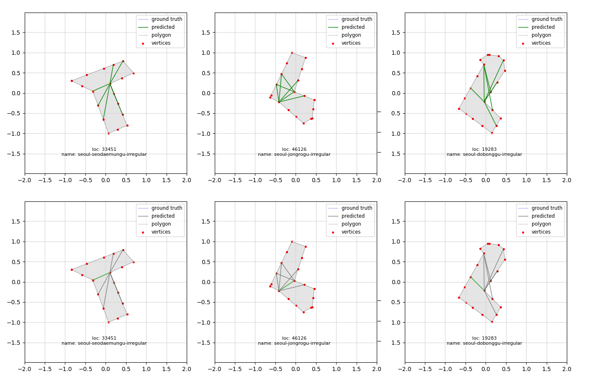

# Polygon Segmentation with GCN

In the early stages of architectural design, there is a concept about the axis in which direction the building will be placed. This plays an important role in determining the optimal layout considering the functionality, aesthetics, and environmental conditions of the building.

The goal of this project is to develop a segmenter that can determine how many axes a given 2D polygon should be segmented into and how to make those segmentations using a Graph Convolutional Network (GCN).
<mark>The detailed process for this project is archived [__here__](https://parkcheolhee-lab.github.io/polygon-segmentation/).</mark>


<br>

<p align="center">
  
  <br><br>
  <i>Inference process <br>
From the top, topk segmentations · segmentation selected by predictor</i>
</p>


# Installation
This repository uses the [image](/.devcontainer/Dockerfile) named `nvcr.io/nvidia/pytorch:23.10-py3` for running devcontainer.


1. Ensure you have Docker and Visual Studio Code with the Remote - Containers extension installed.
2. Clone the repository.

    ```
        git clone https://github.com/PARKCHEOLHEE-lab/polygon-segmentation-with-gcn.git
    ```
3. Open the project with VSCode.
4. When prompted at the bottom left on the VSCode, click `Reopen in Container` or use the command palette (F1) and select `Remote-Containers: Reopen in Container`.
5. VS Code will build the Docker container and set up the environment.
6. Once the container is built and running, you're ready to start working with the project.

<br>

# File Details

### data
- `shp/`: The directory containing the raw shapefiles.
- `raw/`: The directory containing the raw data created by `data_creator.py`.
- `processed/merged/`: The directory containing the data for training and testing.

### notebooks
- `data-creation.ipynb`: Execute to create the graph-shaped polygon dataset.
- `polygon-segmentation-with-gcn.ipynb`: Execute the whole processes for the training and testing.

### runs
- `2024-06-06_08-42-18`: The directory containing the tensorboard logs and the states of the training.
- `states/states.pth`: Pre-trained model states.

### src
- `commonutils.py`: Utility functions not related to the model.
- `config.py`: Configurations related to the model and data.
- `data_creator.py`: Creates the graph-shaped polygon dataset in .pt format by a naive algorithm.
    - You can see the created dataset in `projects\polygon_segmentation_with_gcn\data\processed\merged`
- `dataset.py`: Defines the dataset class for training, evaluating and testing.
- `enums.py`: Defines the enumeration classes for the raw data.
- `model.py`: Defines the model class and trainer class.
